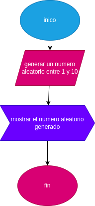

# uso-aleatorio-numeros

# Generador de Números Aleatorios

Este programa en Python genera un número aleatorio entre 1 y 10 utilizando la biblioteca `random`.

# analisis

 variable almacena el número aleatorio generado por la función generar_numero_aleatorio(). Luego, este número se imprime en la consola utilizando la función print().

 # diseño

 

 # construccion